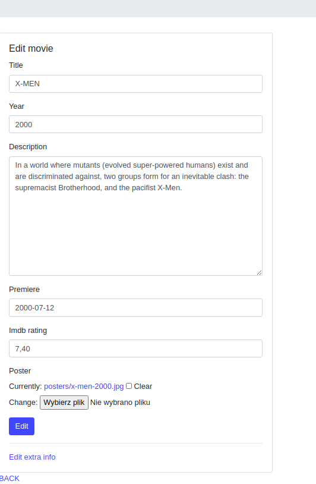

# filmscore
My first page
Hi, this is my fist website. Django, Python.
As part of the practice, I also put this page on the heroku (heroku cleans db ech 30 minutes so ther will be no photos unless you upload some)
https://filmscore.herokuapp.com/films/all/
Functionalities (below you can find screens from page)
1. Login and user creation
2. Adding films
3. Rating and review films
4. Edit films
5. Homepage film list

........

1. Login and user creation

2. Adding films

3. Rating and review films

4. Edit films

5. Homepage film list

